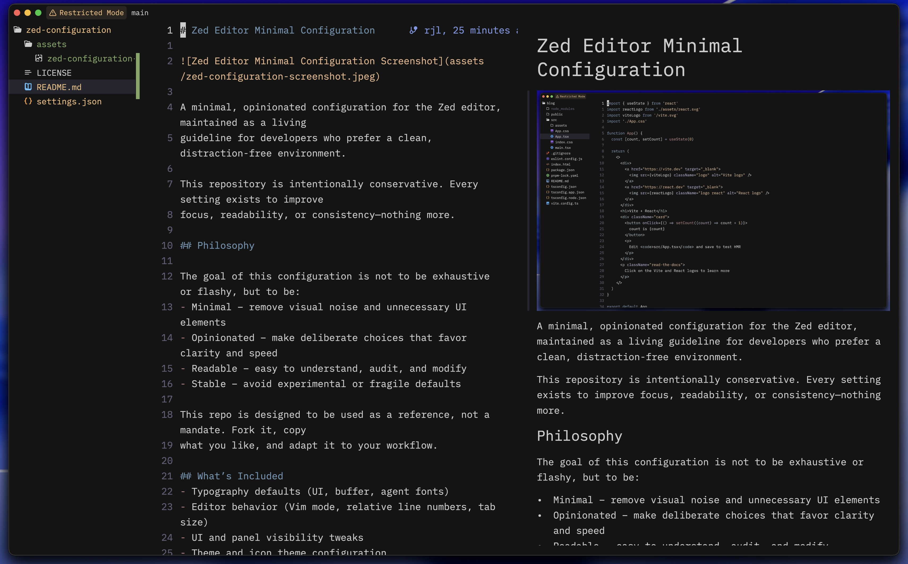

# My Zed Editor Configuration



This repository contains **my personal Zed editor configuration**.

I keep it public so I can track changes over time and so others can see a real,
working setup—not a template or a recommendation. This is how I like Zed to feel
when I open it every day: quiet, predictable, and focused.

Nothing here is meant to be universal or optimal. These are simply the defaults
I’ve settled on after using the editor regularly.

## Why This Exists

This repo exists primarily for myself.

I use it to:

- Keep a clear record of how my editor evolves
- Make intentional, reviewable changes instead of drifting defaults
- Reproduce the same environment on new machines
- Share a concrete reference for people who value minimal UI

This is not a preset, theme pack, or “best practices” repo. It’s a maintained
snapshot of my own preferences.

## How I Think About Changes

I don’t add settings casually. When something changes here, it’s usually because
I’ve decided I want Zed to behave _less_ cleverly or _less_ noisily.

Most changes align with one or more of these ideas:

- Reduce visual noise and background UI
- Prefer explicit behavior over inferred or automatic behavior
- Keep configuration readable and easy to audit
- Avoid experimental or fragile options unless they clearly pay off

If a setting doesn’t noticeably improve focus, readability, or consistency, I
generally remove it.

## What This Configuration Covers

At the moment, this setup includes:

- Typography choices (UI, buffer, and agent fonts)
- Core editor behavior (Vim mode, line numbers, tab size)
- Visibility and behavior of panels, toolbars, and window chrome
- Theme and icon theme selection
- A small set of quality-of-life defaults I’ve found useful

I try to keep commits small and scoped so the history stays readable. The commit
log is part of the documentation.

## Fonts

I use **Lilex Nerd Font**.

On macOS, it can be installed with Homebrew:

```bash
brew install font-lilex-nerd-font
```

Other Nerd Fonts should work as well, though spacing and glyph alignment may vary.

## Configuration Snapshot

Below is a representative subset of the configuration in this repository. It’s
not exhaustive, but it reflects the overall direction and priorities of the
setup.

```jsonc
{
  // Fonts & Typography
  "ui_font_family": "Lilex Nerd Font",
  "buffer_font_family": "Lilex Nerd Font",
  "ui_font_size": 18.0,
  "buffer_font_size": 18.0,
  "agent_ui_font_size": 18.0,
  "agent_buffer_font_size": 18.0,

  // Theme & Icons
  "theme": "Vague",
  "theme_overrides": {
    "Vague": {
      "border": "#141415",
    },
  },
  "icon_theme": "Colored Zed Icons Theme Dark",

  // Editor Behavior
  "vim_mode": true,
  "tab_size": 2,
  "relative_line_numbers": "enabled",
  "inline_code_actions": false,
  "show_wrap_guides": false,

  // Formatting
  "formatter": "auto",
  "format_on_save": "on",

  // Cursor & Selection
  "current_line_highlight": "none",
  "rounded_selection": false,
  "cursor_blink": false,

  // Popovers & Guides
  "hover_popover_enabled": false,
  "indent_guides": {
    "enabled": false,
  },

  // Gutter & Minimap
  "gutter": {
    "folds": false,
  },
  "minimap": {
    "thumb_border": "none",
  },

  // Scrollbars
  "scrollbar": {
    "show": "never",
  },

  // Panels & Sidebars
  "project_panel": {
    "auto_fold_dirs": false,
    "button": false,
    "entry_spacing": "standard",
    "indent_guides": {
      "show": "never",
    },
  },
  "outline_panel": {
    "auto_fold_dirs": false,
  },
  "git_panel": {
    "tree_view": true,
  },
  "notification_panel": {
    "button": false,
  },

  // Terminal
  "terminal": {
    "alternate_scroll": "off",
    "blinking": "off",
    "toolbar": {
      "breadcrumbs": false,
    },
  },

  // Tabs, Toolbars & Window Chrome
  "tab_bar": {
    "show": false,
  },
  "preview_tabs": {
    "enabled": false,
  },
  "toolbar": {
    "breadcrumbs": false,
    "quick_actions": false,
    "selections_menu": false,
  },
  "title_bar": {
    "show_project_items": false,
    "show_user_picture": false,
    "show_user_menu": false,
    "show_sign_in": false,
    "show_branch_icon": false,
    "show_branch_name": false,
  },
  "status_bar": {
    "experimental.show": false,
  },

  // Window & Layout
  "window_decorations": "client",

  // Autocomplete & Inlay Hints
  "show_edit_predictions": true,
  "inlay_hints": {
    "enabled": true,
  },

  // Git Integration
  "git": {
    "inline_blame": {
      "enabled": true,
    },
  },

  // Session Management
  "session": {
    "restore_unsaved_buffers": false,
  },

  // Privacy & Telemetry
  "telemetry": {
    "diagnostics": false,
    "metrics": false,
  },
}
```

Use whatever parts of this are helpful. Ignore the rest.

## Keybindings

Custom keybindings (`keymaps.json`) are not included yet.
I’m still in the process of migrating my Neovim keybindings to Zed.

I’m still in the process of migrating my Neovim keybindings to Zed. When they’re
ready, they’ll follow the same approach as everything else here: minimal,
explicit, and easy to reason about.

## Non-Goals

This repository is intentionally not trying to:

- Represent best practices for all Zed users
- Cover every available setting
- Enforce a specific workflow or layout
- Act as a polished or branded configuration pack

It’s simply the configuration I use and maintain.

If it’s useful to you, great. If not, that’s fine too.
